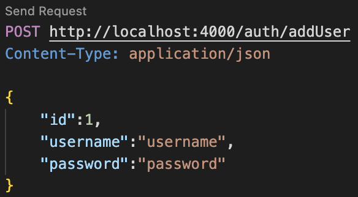

# NodeJS and MYSQL project template

## TL;DR:
1. Clone this repository
2. Navigate to the backend folder
3. Run ```npm install``` to install all libraries
4. Change the values inside ```/backend/configs/mysql.js``` file with your MYSQL credentials (host and port should remain the same by default).
```JAVASCRIPT
    host: '127.0.0.1',
    port: '3306',
    user: 'your_mysql_user',
    password: 'your_mysql_pw',
    database: 'your_mysql_database'
```
5. Run ```node app.js``` to start the NodeJS server


### MySQL Example:
I've included a simple MySQL example that you could use to test out if everything works.
In ```/backend/routes/``` folder you'll find ```addUser.js``` file which contains two HTTP Methods: 
1. ```router.post('/addUser', ...)``` is a HTTP POST method to add a user to the mysql table ```users```.
2. ```router.get('/getUsers', ...)``` is a HTTP GET method to get all users from the mysql table ```users```.

You can use the code below to create the users table in your MySQL database:
```SQL
CREATE TABLE users(
    `id` INT NOT NULL PRIMARY KEY,
    `username` CHAR(255) NOT NULL,
    `password` CHAR(255) NOT NULL
);
```

One way to test your routes: ```/addUser``` and ```/getUsers``` is to use a VSCode extension ```humao.rest-client```. 
- Once you install this extension, create a file inside your project directory ```routes.rest``` 
- Here is how I configured the file to register a user to MongoDB in this NodeJS-MongoDB-Template:
```JSON
POST http://localhost:4000/auth/addUser
Content-Type: application/json

{
    "id":1
    "username": "username",
    "password": "pass"
}
```
- The first line specifies the type of HTTP request followed by the URL
- The second line specified that the content type will be of type json
- Then we send a JSON string
- To run the request press the ```Send Request``` button


### Extras:
#### HTML and CSS (frontend):
I also took the liberty to include the frontend (HTML and CSS) located in ```/backend/public/``` folder. Using the code below we tell NodeJS to render the ```index.html``` file. and the ```'/'``` part specified the root path of the url. For example, the ```index.html``` page will be loaded on ```http://localhost:4000/```. 
```JAVASCRIPT
app.get('/', (req, res) => {
    res.render('index');
});
```
#### Linking MySQL HTTP routes:
Since our MySQL HTTP methods are located in a separate file, we need to link them to the main NodeJS file: ```app.js```. This is done by importing the ```addUser.js``` file with ```const users = require('./routes/addUser');``` and using the ```app.use('/auth', users);``` to specify the middleware for our MySQL HTTP methods. 